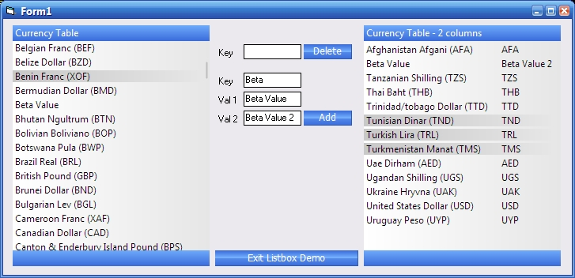



## iPhone style smooth scroll listbox \(beta\)

### Description

iPhone style low friction smooth scrolling listbox. click drag, let go and the list smooth scrolls to a stop. allows 2 values to be stored against a key and either 1 or both to be displayed. long text is shortened to correct lengths with a '...' suffix. context bar on the right lets you know where you are in the list. there is a custom data class behind the scenes and the user control maintains a linked list on the data to provide quick sorting, regardless of physical data order. arrow up/down or mousedown on header/footer for fast scroll.

this is beta, so these functions are implemented but not public interfaced: font name/size and colors.

enjoy

Mike
 
### More Info
 

             |
---                |---
**Submitted On**   |2009-01-05 13:54:36
**By**             |[Michael Toye](https://github.com/Planet-Source-Code/PSCIndex/blob/master/ByAuthor/michael-toye.md)
**Level**          |Intermediate
**User Rating**    |4.4 (22 globes from 5 users)
**Compatibility**  |VB 6\.0
**Category**       |[Custom Controls/ Forms/  Menus](https://github.com/Planet-Source-Code/PSCIndex/blob/master/ByCategory/custom-controls-forms-menus__1-4.md)
**World**          |[Visual Basic](https://github.com/Planet-Source-Code/PSCIndex/blob/master/ByWorld/visual-basic.md)
**Archive File**   |[iPhone\_sty213964162009\.zip](https://github.com/Planet-Source-Code/michael-toye-iphone-style-smooth-scroll-listbox-beta__1-71615/archive/master.zip)

